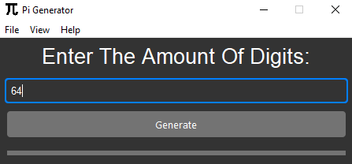

[![Contributors][contributors-shield]][contributors-url]
[![Forks][forks-shield]][forks-url]
[![Stargazers][stars-shield]][stars-url]
[![Issues][issues-shield]][issues-url]
[![MIT License][license-shield]][license-url]

 

  

  <h3 align="center">PI Generator</h3>

  

    Generate PI To How Many Digits You Want
     
    ·
    <a href="https://github.com/Ge64com/PI-Generator/issues">Report Bug</a>
    ·
    <a href="https://github.com/Ge64com/PI-Generator/issues">Request Feature</a>
    .
  

  
Table of Contents

  <ol>
    <li>
      <a href="#about-the-project">About The Project</a>
      <ul>
        <li><a href="#built-with">Built With</a></li>
      </ul>
    </li>
    <li>
      <a href="#getting-started">Getting Started</a>
    </li>
    <li><a href="#usage">Usage</a></li>
    <li><a href="#roadmap">Roadmap</a></li>
    <li><a href="#license">License</a></li>
    <li><a href="#contact">Contact</a></li>
  </ol>

<!-- ABOUT THE PROJECT -->
## About The Project

  

The creation of this program goes back to a year ago when I was learning python. I decided to polish it a little bit and optimize the algorithm.
This program uses the Tkinter library for it's GUI and <a href="https://github.com/fmasanori/PPZ/blob/master/pi%20generator.py">This Algorithm<a> to generate pi.

(<a href="#readme-top">back to top</a>)

## Built With

I have used <a href="python.org">Python</a> for Generating the number and creating the GUI.
* [![Python][Python]][Python-url]

(<a href="#readme-top">back to top</a>)

## Getting Started
Just download the <a href="https://github.com/Ge64com/PI-Generator/releases/latest">latest version</a> from <a href="https://github.com/Ge64com/PI-Generator/releases">releases</a>.

(<a href="#readme-top">back to top</a>)

## Usage
To use this program you just have to enter the amount of digits that you want into the entry and click the "Generate" button and just wait for the result to apear.
The number will be written into a .txt file and you can view it whenever you want with the "Show Pi" command in the "File" menubar ! 
### Note : 
The number WILL BE DELETED if you clean your temporary files often so it is advised to save the txt file somewhere you trust.

(<a href="#readme-top">back to top</a>)

## Roadmap
- [ ] Use other GUI frameworks for enhanced visuals and performance
- [ ] Use other PI generating algorithms
- [ ] Multi-language Support
    - [x] English
    - [ ] Persian

See the [open issues](https://github.com/Ge64com/PI-Generator/issues) for a full list of proposed features (and known issues).

(<a href="#readme-top">back to top</a>)

## License

Distributed under the MIT License. See `LICENSE.md` for more information.

(<a href="#readme-top">back to top</a>)

<!-- CONTACT -->
## Contact
[![YouTube][youtube-shield]][youtube-url]
[![Instagram][instagram-shield]][instagram-url]
[![Twitter][twitter-shield]][twitter-url]
[![Telegram][telegram-shield]][telegram-url]

(<a href="#readme-top">back to top</a>)

[contributors-shield]: https://img.shields.io/github/contributors/ge64com/PI-Generator
[contributors-url]: https://github.com/ge64com/PI-Generator/graphs/contributors
[forks-shield]: https://img.shields.io/github/forks/Ge64com/PI-Generator
[forks-url]: https://github.com/Ge64com/PI-Generator/network/members
[stars-shield]: https://img.shields.io/github/stars/Ge64com/PI-Generator
[stars-url]: https://github.com/Ge64com/PI-Generator/stargazers
[issues-shield]: https://img.shields.io/github/issues/Ge64com/PI-Generator
[issues-url]: https://github.com/Ge64com/PI-Generator/issues
[license-shield]: https://img.shields.io/github/license/Ge64com/PI-Generator
[license-url]: https://github.com/Ge64com/PI-Generator/blob/main/LICENSE.md
[product-screenshot]: screenshots/screenshot.PNG
[python]: https://img.shields.io/badge/Python-000000?logo=python&logoColor=white
[python-url]: https://python.org/
[youtube-shield]: https://img.shields.io/badge/YouTube-ff0000?logo=youtube&logoColor=white
[youtube-url]: https://youtube.com/@Ge64
[instagram-shield]: https://img.shields.io/badge/Instagram-E4405F?logo=instagram&logoColor=white
[instagram-url]: https://instagram.com/Ge64com
[twitter-shield]: https://img.shields.io/badge/Twitter-00acee?logo=twitter&logoColor=white
[twitter-url]: https://twitter.com/Ge64com
[telegram-shield]: https://img.shields.io/badge/Telegram-0088cc?logo=telegram&logoColor=white
[telegram-url]: https://t.me/Ge64com
